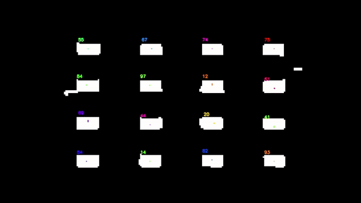

# Deal or No Deal Solver

In the arcade version of Deal or No Deal, you can correctly pick the highest case if you are able to follow their shuffling pattern.
However, the shuffling is fast and nearly impossible for humans to track unaided.

## Automatic Mode
Automatically track cases using openCV and momentum to detect swapping.

| Input | Result |
|---|---|
|  |  |

**Usage:** Install dependancies with pypackage compatable package manager, then run `custom tracking.py`

Still needs mobile interface, testing on diverse videos, automatic number detection, and speedup.
There's a performance bottleneck in preprocessing, so [rewriting in C++](cpp) wouldn't even help.

I then realized an easier solution, which became [manual mode](https://funblaster22.github.io/DealNo-Solver/slomo.html).
Can still overcome the speed issue by streaming to server or [processing in browser](https://funblaster22.github.io/DealNo-Solver/auto.html).

## [Manual Mode](https://funblaster22.github.io/DealNo-Solver/slomo.html)
Low-tech alternative to automatic mode that solves the problems with recording a phone video.
Solves problems with using phone to record video.

**Usage:** Tap to toggle slo-mo/regular speed.

## Camera record video/slomo
For comparison, recording with your phone's camera app has the following problems:
- takes too long
  - Must wait until done shuffling to review
  - Slow motion is too slow
  - Must edit slow-mo range (by default beginning and end is regular speed)
- Error-prone
  - Can scroll too fast along regular speed video
  - Can forget to adjust slo-mo range

